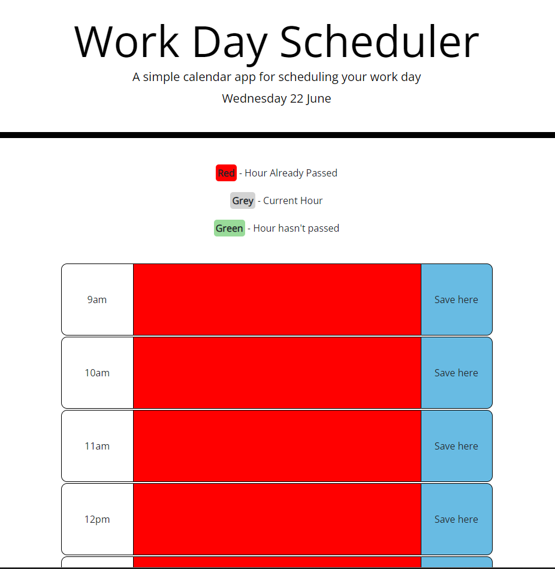
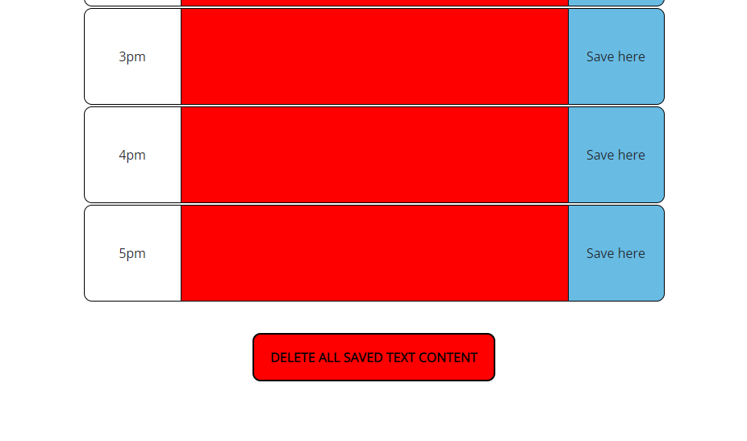

# Week-5-Challenge-Daily-Hourly-Planner

## Description
The application is an hourly planner for an employee to use during work hours (9am-5pm). Once the webpage loads, the current date is rendered at the top below the jumbotron heading. 

There is a colour code to indicate to users what the different colours signify.

There is a grid underneath this colour code that has one row for every hour. When a user clicks on the middle column of a row, they will be able to type text into that column. If the user wishes to save that text so that it persists even when the page is reloaded or exited, they can press the 'Save here' button column to the right.

There is a button at the bottom of the webpage that can be used to delete all the locally stored text the user has saved.

## Screenshots of application

## Link to deployed URL
https://ishan-wijesingha99.github.io/Week-5-Challenge-Daily-Hourly-Planner/